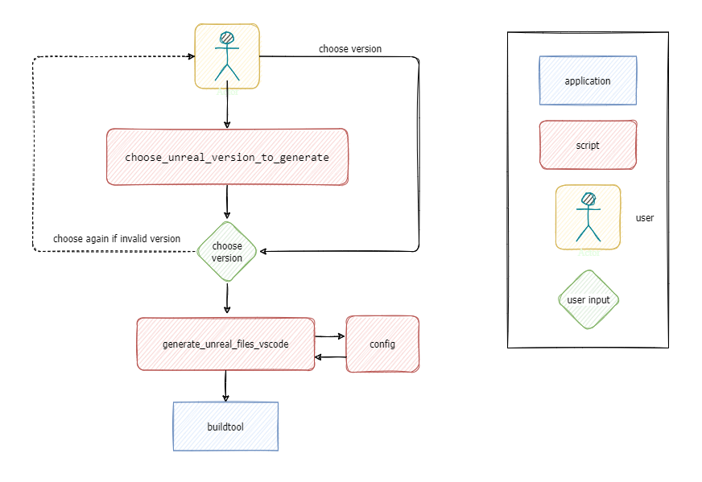

# The Unreal Engine project file generator

The Unreal Engine [project_file_generator](https://github.com/SonnyLarsson/misc-scripts/tree/main/project_file_generator) is for those of us who need Unreal Engine project files for VS Code:

* Sometimes installing Unreal Engine won't give you a context-option to generate project files for VS Code, no matter what you do.
* Sometimes you want a different shortcut to generate files for a specific version.
* Sometimes you want to pick which version you want to generate files for.
* Sometimes you want a way to automate generating files for VS Code.

The **project_file_generator** scripts solve all of the above.

<br>

The project_file_generator consists of three batch files. The scripts are suitable for automation, or manual use:

* Edit `config.bat` for configuration of single-version project file generation.
* Run `generate_unreal_files_vscode.bat` to trigger project file generation.
* Run `choose_unreal_version_to_generate` for a simple text-based user interface with version options.

<br>

## Background

Our game development project had a problem...

Our server setup ran a number of borrowed scripts for custom Unreal Engine project file generation, and each script had its own set of hardcoded paths and values. The complexity of the setup had reached a point where Unreal Engine updates, or moved code, required a fair bit of testing and editing. Small changes to the GitlabRunner environment would need several edits, and subsequent testing to make sure everything worked.

Then, *someone* suggested that not only could we use variables for each value we kept repeating, but we could also share those variables between all files. And so, the **config** and **generate_unreal_files_vscode** scripts were written, as a proof of concept. This proof of concept turned out so well that we'd soon replaced all our scripts with scripts depending on one **config** script.

Giddy from our success, *someone else* declared that they'd always wanted to turn everything into *Powershell*, and so we did. Consequently, our server now runs a set of Powershell scripts built on the principles established in the original proof of concept. However, much of what was once a part of a *config* script now lies in environment parameters.

The **project_file_generator** scripts never went obsolete. When Windows 11 came out, the Unreal Engine installer wouldn't add the appropriate context menu option for VS Code. The scripts became a way of generating project files with a single (well, double) click. The scripts also remain a useful means for automated local file generation.

The third script—**choose_unreal_version_to_generate**—was created as *someone* kept collecting, building and testing out different versions of Unreal Engine. Constantly editing scripts or running console commands to generate project files was a bit much. Thus, we added a simple text-based interface for picking a version of Unreal Engine.

<br>

## Contents

* Scripts
  * config
  * generate_unreal_files_vscode
  * choose_unreal_version_to_generate
* Recommended setup
* How it works
  * Automated project file generation for a single version of Unreal Engine
  * Manual project file generation for a single version of Unreal Engine
  * Manual project file generation with a choice between multiple versions of Unreal Engine


<br>

---

<br>

# Scripts

This section describes the scripts of the project_file_generator.

<br>

<br>

## config

A script that maps directory paths.

<br>

### Use cases

If all you need is a quick way to generate files for one specific version, you can set your paths in config.bat.

> Note: **⚠** If you want to be able to generate project files for more than one version of Unreal Engine, leave the config script untouched, and edit the **choose_unreal_version_to_generate** script instead. Read more about choose_unreal_version_to_generate [here](#chooseunrealversiontogenerate).

<br>


*Run the generate_unreal_files_vscode script to use the settings in config.bat.*

<br>

### Setup

The following lines are the default settings in the config script:
```shell
set "unreal_path=%UNREAL_BUILDTOOL_PATH%"
set "project_path=%UNREAL_PROJECT_PATH%"
```

<br>

Change the lines above into something like the following:

* Set *unreal_path* to the location of the **buildtool** you want to use, in the install folder of the version of Unreal Engine you use.
* Set *project_path* to the location of your **.uproject-file**, in the root folder for your local game files.

Another option is to us environment variables, and leave the config script as is:

* Set *UNREAL_BUILDTOOL_PATH* to the location of the **buildtool** you want to use.
* Set *UNREAL_PROJECT_PATH* to the location of your **.uproject-file**.

The latter option is especially handy when running the scripts as part of an automated toolchain.

<br>

Here is an example:

```shell
set "unreal_path=C:\Program Files\Epic Games\UE_5.0\Engine\Binaries\DotNET\UnrealBuildTool\UnrealBuildTool.exe"
set "project_path=C:\Users\[user]\OneDrive\Documents\Gitlab\[project folder]\[project].uproject"
```

<br>

> Note: The folder structure for Unreal Engine 4.7.2 and below places the buildtool in the *DotNet* folder, instead of the *DotNet\UnrealBuildTool* subfolder.

<br>

<br>

## generate_unreal_files_vscode

A script that triggers project file generation using paths set through **config.bat** .

<br>

### Use cases


*1. Run the generate_unreal_files_vscode script directly.*


*2. Run the generate_unreal_files_vscode script through choose_unreal_version_to_generate.bat.*

<br>

Generally, you shouldn't need to alter this script, but the following cases require changes:

* A new version of Unreal Engine expects different arguments for **buildtool.exe**.
* The script locks up when used in automation. (Remove the *pause*-command at the end of the file.)

<br>

> Note: The *pause* command leaves the window up so you can see the results. This is unnecessary in automation.
>
>
>
>*Remove the pause command at the end of the file.*

<br>

<br>

## choose_unreal_version_to_generate

A script that adds a version picker for Unreal Engine.

<br>

### Use cases

If you have more than one version of Unreal Engine installed, use the choose_unreal_version_to_generate script. Run this script to use the version picker in a console window.


*1. Run choose_unreal_version_to_generate for a text-based version picker.*

<br>


*2. Choose which version of Unreal Engine to generate project for.*

<br>

### Setup

The choose_unreal_version_to_generate script sets the following variables:

* *UNREAL_PROJECT_PATH* is the location of your .uproject-file, in the root folder where you've put your local game files.
* *UNREAL_BUILDTOOL_PATH* is set to the Unreal Engine version you want to generate project files for.

<br>

This script works as follows:

1. Set UNREAL_PROJECT_PATH to a local project folder.
2. List which options are available to the user.
3. Prompt for user input.
4. Map input to conditional statements.
5. **If no condition is met**:
   Goes back to step **2** and prompts the user for input again.
6. **If a condition is met**:
   Jumps to the appropriate tag in the code and sets UNREAL_BUILDTOOL_PATH
7. Call **generate_unreal_files_vscode.bat**.

<br>

Here's an overview of the script:


*Alter the choose_unreal_version_to_generate script to add, remove or change available options.*

<br>

---

<br>

## Recommended setup

1. Put `config.bat` and `generate_unreal_files_vscode.bat` where you want to run project file generation from.
2. If you have several versions of Unreal Engine you want to generate project files for, add `choose_unreal_version_to_generate.bat` to the folder.
3. Edit `config.bat` or set the appropriate environment variables, or edit `choose_unreal_version_to_generate.bat`.

See the [Scripts](#scripts) section for information about script file content.

> Note: It's possible to create a windows shortcut to either **generate_unreal_files_vscode** or **choose_unreal_version_to_generate**. Trigger project file generation from the windows taskbar, or start menu. Use regedit to add a shortcut in the windows context menu.

<br>

## How it works

Here are three use cases for the scripts:

* Automated project file generation for a single version of Unreal Engine
* Manual project file generation for a single version of Unreal Engine
* Manual project file generation with a choice between multiple versions of Unreal Engine

<br>

### Automated project file generation for a single version of Unreal Engine

1. A tool like *GitLabRunner* runs **generate_unreal_files_vscode.bat**.
2. **generate_unreal_files_vscode.bat** runs **config.bat**.
3. **config.bat** sets values to the *unreal_path* and *project_path* variables.
4. **generate_unreal_files_vscode.bat** triggers file generation through the Unreal Engine **buildtool**, using values from *unreal_path* and *project_path*.

<br>


*Automated file generation*

<br>

### Manual project file generation for a single version of Unreal Engine

1. A user runs **generate_unreal_files_vscode.bat**.
2. **generate_unreal_files_vscode.bat** runs **config.bat**.
3. **config.bat** sets values to the *unreal_path* and *project_path* variables.
4. **generate_unreal_files_vscode.bat** triggers file generation through the Unreal Engine **buildtool**, using values from *unreal_path* and *project_path*.

<br>


*Manual project file generation for one version of Unreal Engine*

<br>

### Manual project file generation with a choice between multiple versions of Unreal Engine

1. A user runs **choose_unreal_version_to_generate.bat**.
2. The user chooses a version of Unreal Engine.
3. **choose_unreal_version_to_generate.bat** sets values to the *UNREAL_BUILDTOOL_PATH* and *UNREAL_PROJECT_PATH* variables.
4. **generate_unreal_files_vscode.bat** executes **config.bat**.
5. **config.bat** passes values set by **choose_unreal_version_to_generate.bat** to the *unreal_path* and *project_path* variables.
4. **generate_unreal_files_vscode.bat** triggers file generation through the Unreal Engine **buildtool**, using values from *unreal_path* and *project_path*.

<br>



*Manual project file generation with multiple options for different versions of Unreal Engine*
